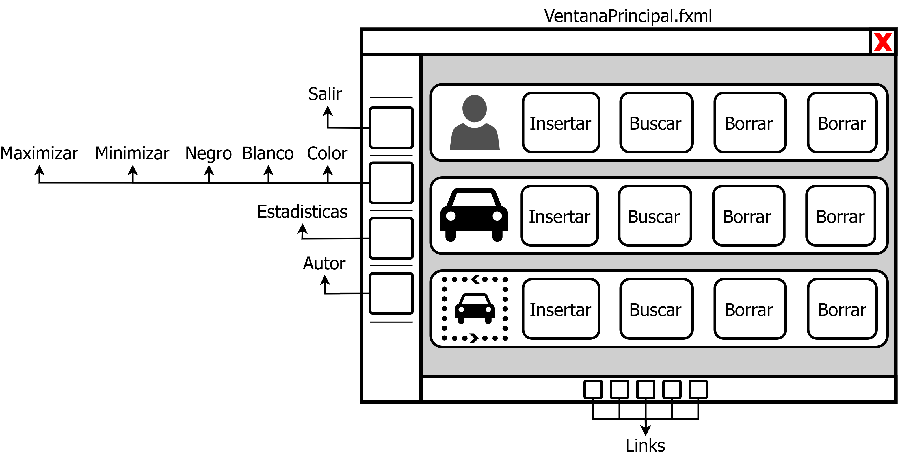
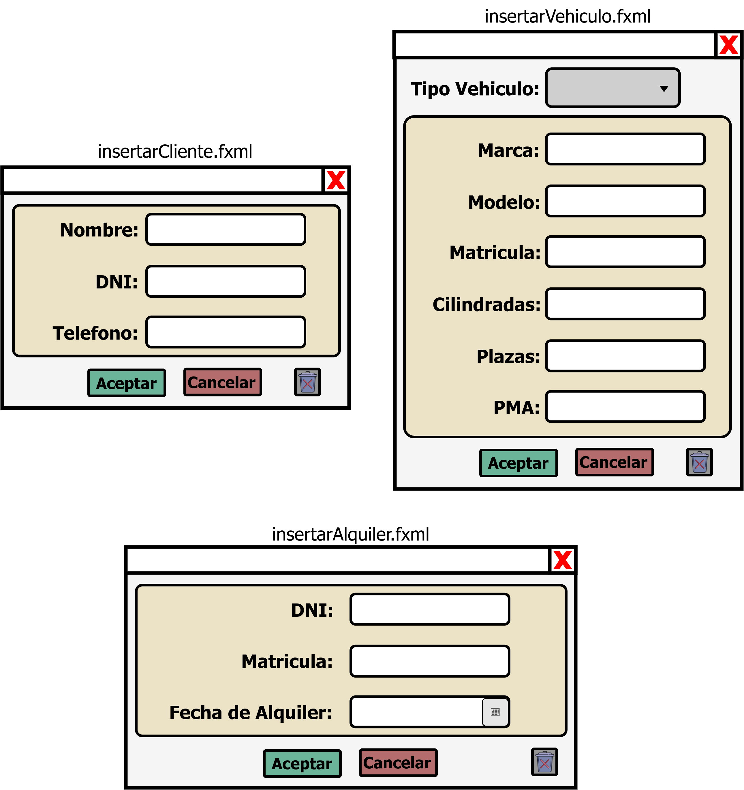

# Tarea: Alquiler de vehículos (v4)
## Profesor: José Ramón Jiménez Reyes
## Alumno: Sergio Fernández Pardo

En esta version del proyecto nos centraremos en migrar el modelo de datos MongoDB y MariaDB en nuestro proyecto.

