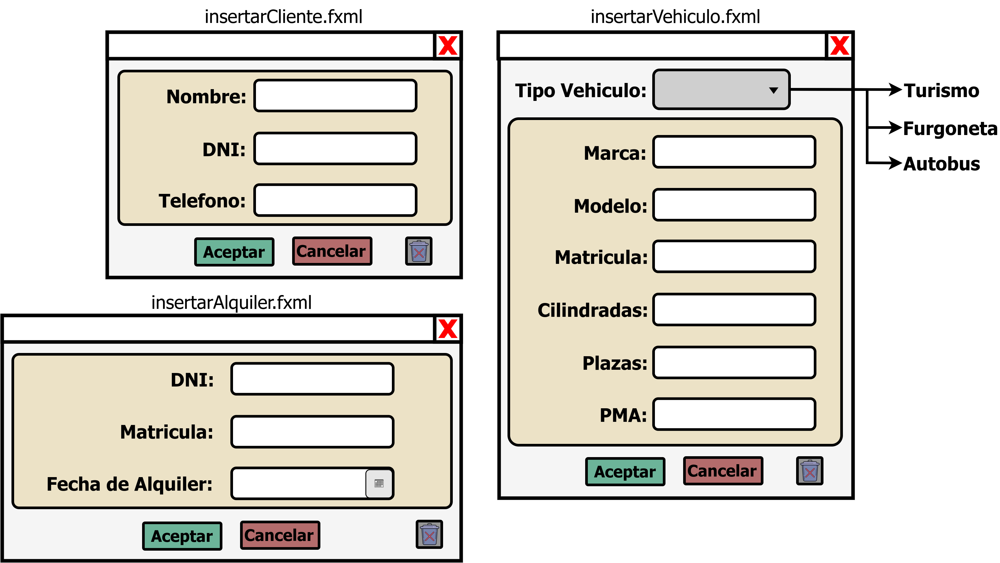
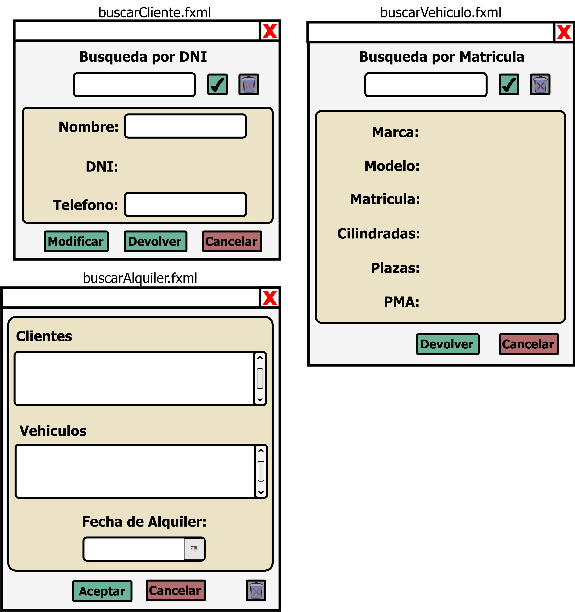

# Tarea: Alquiler de vehículos (v4)
## Profesor: José Ramón Jiménez Reyes
## Alumno: Sergio Fernández Pardo

En esta version del proyecto nos centraremos en migrar el modelo de datos que teniamos "ficheros" XML (Clientes, Vehiculos, Alquileres), a las bases de datos MongoDB y MariaDB.

<table>
  <tr>
    <td>  <td>
  </tr>
</table>

 

<table>
  <tr>
   <td>
      
  

   </td>
  </tr>
</table>

<table>
  <tr>
   <td>
      
  

   </td>
  </tr>
</table>
